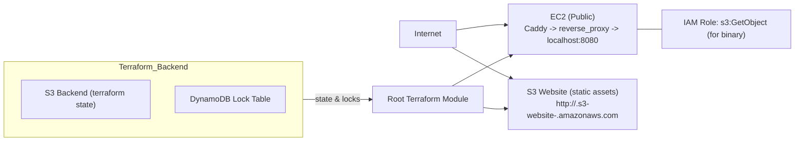

# Minimal AWS Prototype: EC2 App + S3 Static Assets

Overview

This repository contains a small, prototype AWS Terraform deployment that:

- Provisions a single public EC2 instance that boots a local listening binary bound to 127.0.0.1:8080 and runs Caddy as a reverse proxy on port 80.
- Provisions an S3 bucket configured for static website hosting to serve static assets (HTTP).
- Provides a bootstrap module to create an S3 bucket + DynamoDB table for Terraform remote state and locking (recommended workflow).

This layout is intentionally minimal and low-cost for prototyping purposes (single instance, single AZ, no load balancer, no HTTPS).

Repository layout

- bootstrap/ — terraform resources to create an S3 bucket and DynamoDB table used as the Terraform backend
- s3/ — reusable module to create a static-website S3 bucket with a public GET policy
- ec2/ — module to create a single public EC2 instance, IAM role for S3 access, security group, and cloud-init to install binary + Caddy
- Root terraform files — provider configuration, module wiring, example terraform.tfvars

Quickstart

1. Bootstrap state backend (must be done before enabling S3 backend in the root):
   - cd bootstrap
   - terraform init
   - terraform apply -var="backend_bucket_name=<unique-bucket-name>" -var="dynamodb_table_name=<unique-table-name>"
   - Note the outputs: backend_bucket and backend_dynamodb_table

2. In the repo root initialize Terraform using the bootstrap outputs as backend-config (recommended):
   - terraform init \
     -backend-config="bucket=<bootstrap-bucket>" \
     -backend-config="key=envs/dev/terraform.tfstate" \
     -backend-config="region=<region>" \
     -backend-config="dynamodb_table=<bootstrap-lock-table>"

3. Edit terraform.tfvars (root) and replace placeholders with real values:
   - static_bucket_name: globally-unique name for the website bucket
   - app_binary_bucket: S3 bucket containing the compiled binary the EC2 instance will download
   - app_binary_key: S3 object key for the binary
   - vpc_id, subnet_id: choose a public subnet (default VPC or existing public subnet)
   - key_name (optional): EC2 Key Pair name to enable SSH
   - allow_ssh (optional): set to true and set ssh_cidr to your IP if you want SSH
   - ami_id (optional): if null, a default Ubuntu AMI lookup is used; specify an explicit AMI if desired
   - instance_type, app_port, tags

4. Plan & apply
   - terraform plan -var-file=terraform.tfvars
   - terraform apply -var-file=terraform.tfvars

5. Post-apply steps
   - Upload your static website files (index.html, assets) to the S3 static bucket (s3_website_url output contains the website endpoint).
   - Upload your compiled binary to s3://<app_binary_bucket>/<app_binary_key> so the EC2 user-data can download & run it.
   - Visit the EC2 public IP (output ec2_public_ip) to see the application proxied by Caddy.

Key tfvars / variables to set (root terraform.tfvars contains placeholders)

- aws_region: AWS region to deploy into (default: us-east-1)
- vpc_id: VPC where EC2 and subnet live (use default VPC or an existing one)
- subnet_id: Public subnet ID for the EC2 instance
- static_bucket_name: Globally unique S3 bucket name for website hosting
- app_binary_bucket: S3 bucket containing your compiled binary (object must be accessible to the EC2 role)
- app_binary_key: S3 object key of your binary
- key_name: (optional) EC2 key pair name to allow SSH
- allow_ssh: (bool) whether to open SSH in security group (default: false)
- ssh_cidr: CIDR to allow SSH from (if allow_ssh = true)
- instance_type, ami_id, app_port, tags

Important notes & caveats

- S3 static website endpoints are HTTP-only. If you require HTTPS or a custom domain, add CloudFront + ACM or an ALB in front.
- S3 bucket names are globally unique — choose a unique static_bucket_name.
- Account-level S3 Block Public Access settings can prevent public website hosting even if the module creates a public policy. Check with your AWS admin if website objects remain inaccessible.
- The EC2 cloud-init template assumes an Ubuntu/Debian family AMI. If you use Amazon Linux, adjust ec2/cloud-init.tpl accordingly.
- If S3 objects (binary) are KMS-encrypted, add kms:Decrypt permission to the EC2 IAM role policy.
- Provider pinning in versions.tf currently uses AWS provider ~> 4.0. Adjust if your environment requires a newer provider.

Outputs

After a successful apply the root module exposes useful outputs:

- ec2_public_ip — public IP address of the app EC2 instance (hit this in a browser)
- ec2_public_dns — public DNS name
- s3_website_url — static website endpoint for the S3 bucket
- iam_role_name — IAM role created for the EC2 instance
- instance_profile — instance profile attached to the EC2 instance

Security recommendations (prototype)

- Restrict SSH (set allow_ssh = true only when needed and set ssh_cidr to your IP/CIDR).
- Use least-privilege IAM (the EC2 role is scoped to s3:GetObject for the specific binary object).
- Use the bootstrap pattern to keep Terraform state in S3 with DynamoDB locking.

Next steps / enhancements

- Add HTTPS and a custom domain with CloudFront + ACM or an ALB + ACM.
- Harden network placement: create a custom VPC, private subnets for application and NAT for egress.
- Consider baking the binary into an AMI or containerizing and using ECS for easier deployment.

Support

If you need help customizing cloud-init, adding KMS support, or converting this to an autoscaled architecture, open an issue or request follow-up changes in this repo.
